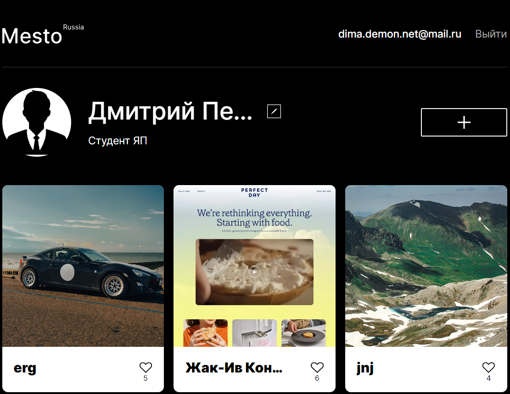

# Проект Mesto бэкенд + фронтенд

Проект "Mesto" - это простое веб-приложение, которое представляет собой страницу для обмена фотографиями и путешествиями. Пользователи могут просматривать фотографии различных мест, добавлять свои собственные фотографии, ставить лайки и редактировать свой профиль. [Ссылка на сайт](https://dmitry145528.github.io/mesto/) | [Ссылка на макет в Figma](https://www.figma.com/file/oV518UvkIxSPcm7jH3FDnI/JavaScript.-Sprint-9?type=design&node-id=0-1&mode=design&t=TV2nRwYVOqtVrDvX-0)



## Структура проекта:

* [Mesto (версия Java Script)](https://github.com/Dmitry145528/mesto)
* [Mesto (версия React)](https://github.com/Dmitry145528/react-mesto-auth?tab=readme-ov-file)
* [Mesto (версия для сервера)](https://github.com/Dmitry145528/express-mesto-gha)
* Mesto (версия с фронтендом и бэкендом) - этот репозиторий

## Что сделал:

* Реализовал на Node.js и Express.js, сервер обрабатывает запросы, взаимодействует с базой данных MongoDB и обрабатывает ошибки.

## Реализованный функционал:

* Реализованы роуты и контроллеры для работы с пользователями (регистрация, авторизация, получение информации о текущем пользователе, обновление данных пользователя).

* Реализована аутентификация с использованием JWT (JSON Web Token) для безопасной передачи информации между клиентом и сервером.

* Реализованы роуты и контроллеры для работы с карточками (создание, получение, обновление, удаление карточек).

* Реализованы мидлвары для обработки запросов, аутентификации и обработки ошибок.

* Взаимодействие с базой данных MongoDB для сохранения пользовательских данных и карточек.

* Пользователи могут просматривать фотографии мест, загруженные другими пользователями.

* Пользователи могут выражать своё восхищение фотографиями, ставя лайки.

* Пользователи могут добавлять новые места, создавая собственные карточки, которые будут доступны для просмотра другим участникам. Также имеется возможность удалить собственную карточку, если она перестала быть актуальной.

* Пользователи могут просматривать фотографии в увеличенном режиме, открывая их в модальном окне.

* Каждый пользователь имеет возможность изменить свои данные, такие как имя, аватар и деятельность.

* Пользователи могут регистрироваться и авторизовываться.

* Реализовал попапы с информацией о статусе входа (успешный вход, ошибка).

## Технологии:

* Node.js: Платформа для выполнения JavaScript кода на сервере.
* Express.js: Фреймворк для создания веб-приложений на Node.js.
* MongoDB: Документоориентированная NoSQL база данных.
* JWT (JSON Web Token): Механизм аутентификации для безопасной передачи информации между клиентом и сервером.
* dotenv: Модуль для загрузки переменных среды из файла .env.
* mongoose: ODM (Object Data Modeling) для работы с MongoDB через Node.js.
* cookie-parser: Middleware для работы с куки в Express приложениях.
* celebrate и Joi: Библиотеки для валидации данных и обработки ошибок в Express.js приложениях.
* errors из celebrate: Middleware для обработки ошибок валидации данных.
* logger middleware: Middleware для логирования запросов и ошибок.

## Инструкция по запуску:

1. **Клонируйте репозиторий:**

   ```bash
   git clone git@github.com:Dmitry145528/react-mesto-api-full-gha.git
   git clone https://github.com/Dmitry145528/react-mesto-api-full-gha.git

_Для бекэнд части_

1. **Перейдите в директорию проекта, выполнив команду:**

    `cd react-mesto-api-full-gha`

    `cd backend`

2. **Установите все необходимые зависимости проекта, выполнив команду:**

   `npm install`

3. **Создайте файл .env в корневой директории проекта и добавьте следующие переменные среды:**

    `PORT=3000`
    
    `MONGO_URL=mongodb://127.0.0.1:27017/mestodb`

4.  **Вы можете запустить сервер:**

    `npm run start`

5.  **Вы можете запустить сервер с hot-reload:**

    `npm run dev`

`Примечание:` В файле App.js бекенд части необходимо настроить доступ CORS для разрешения запросов с фронтенд части.

_Для фронтенд части_

1. **Перейдите в директорию проекта, выполнив команду:**

   `cd react-mesto-api-full-gha`

   `cd frontend`

2. **Установите все необходимые зависимости проекта, выполнив команду:**

   `npm install`

3. **Перед запуском проекта в режиме разработки или деплоем на хостинг, необходимо собрать проект. Для этого выполните команду:**

    `npm run build`

4.  **Вы можете запустить проект в режиме разработки, выполнив команду:**

    `npm run dev`

`Примечание:` Для корректной работы фронтенд части необходимо изменить файлы utils/Api.js и utils/Auth.js собственными значениями, соответствующими вашему бекенду.

## Требования:

Перед началом убедитесь, что у вас установлены:

- [Node.js](https://nodejs.org/)
- [MongoDB](https://www.mongodb.com/)

## Статус разработки:

✅ _Завершено_